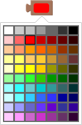
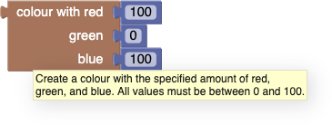
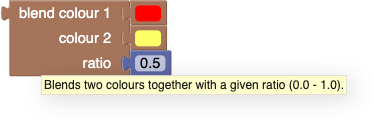

Colours are used in many graphics programs.

# Blocks
## Picking a colour from a palette

The simplest way to get a colour is with the **colour picker**.  It appears as a red rounded rectangle.  When clicked, a palette of colours pops opens, from which one can choose a colour.

## Creating a colour from red, green, and blue components

The **colour with** block allows one to specify the desired percent of red, green, and blue.  The example below builds a colour with the maximum amounts of red and blue and no green (making purple):

Note that we use [a range from 0 to 100 (inclusive)](https://www.december.com/html/spec/colorper.html) for each component, not the less intuitive range of 0 to 255 generally used by programmers and graphic designers.

## Generating a random colour

The **random colour** block generates a random colour each time it is called.

Specifically, each of the red, green, and blue components is a number from 0 to 255 (inclusive), with equal likelihood.

## Blending colours

This block blends two colours together, as though one were mixing paint together (actually light, not paint).  The example below produces the colour that would be obtained by mixing equal amounts of red and yellow (the result would be orange).

If the ratio were 0, the result would have no red and all yellow.  If the ratio were 1, the result would be all red and no yellow.

# Technical details

Blockly colours are represented as text of the form "#rrggbb" where "rr", "gg", and "bb" represent the red, green, and blue components, respectively, in the hexadecimal range 00 to ff.  Since colours are usually passed to the "set colour" block in the turtle graphics application, most users are never aware of this, but it is exposed by the following program:

which prints "#ff0000".

Note that [blending light is different from blending pigments](http://learn.leighcotnoir.com/artspeak/elements-color/primary-colors/).  Blending red, green, and blue light in equal ratios yields white light, while blending red, green, and blue paint yields a muddy colour.
