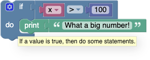
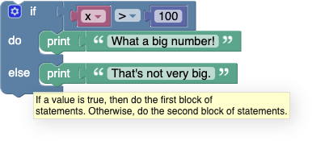
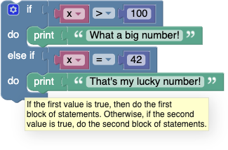
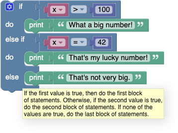
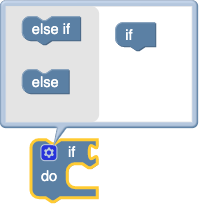
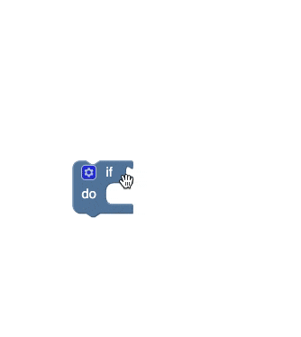

Conditional statements are central to computer programming.  They make it possible to express statements like:
  * If there is a path to the left, turn left.
  * If score = 100, print "Well done!".

See [additional information about conditional statements](https://en.wikipedia.org/wiki/Conditional_(programming)).

# Blocks

## If blocks

The simplest conditional statement is an **if** block, as shown:

When run, this will compare the value of the variable **x** to 100.  If it is larger, "What a big number!" will be printed.  Otherwise, nothing happens.

## If-Else blocks

It is also possible to specify that something should happen if the condition is _not_ true, as shown in this example:

As with the previous block, "What a big number!" will be printed if **x** > 100; otherwise, "That's not very big." will be printed.

An **if** block may have zero or one **else** sections but not more than one.

## If-Else-If blocks

It is also possible to test multiple conditions with a single **if** block by adding **else if** clauses:

The block first checks if **x** > 100, printing "What a big number!" if it is.  If it is not, it goes on to check if **x** = 42.  If so, it prints "That's my lucky number."  Otherwise, nothing happens.

An **if** block may have any number of **else if** sections.  Conditions are evaluated top to bottom until one is satisfied, or until no more conditions are left.

## If-Else-If-Else blocks

As shown here, **if** blocks may have both **else if** and **else** sections:

The **else** section guarantees that some action is performed, even if none of the prior conditions are true.

An **else** section may occur after any number of **else if** sections, including zero.

# Block Modification

Only the plain **if** block appears in the toolbox:

To add **else if** and **else** clauses, the click on the gear icon, which opens a new window:

Drag **else if** and **else** clauses under the **if** block, as well as reordering and removing them.  When finished, click on the gear icon, which closes the window, as shown here:

Note that the shapes of the blocks allows any number of **else if** subblocks to be added but only up to one **else** block.
