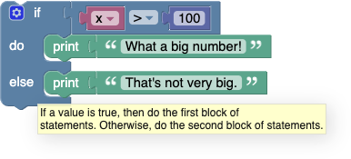

[Boolean logic](https://en.wikipedia.org/wiki/Boolean_algebra) is a simple mathematical system that has two values:
  * **true**
  * **false**

Logic blocks are generally used to control [conditional blocks](IfElse) and [repeat blocks](Loops#repeat-while).

Here's an example:

If the value of the variable **x** is greater than 100, the condition is **true**, and the text "What a big number!" is printed.  If the value of **x** is not greater than 100, the condition is **false**, and "That's not very big." is printed.

Boolean values can also be stored in variables and passed to functions, the same as number, text, and list values.

# Blocks

If a block expects a Boolean value as an input, it usually interprets an absent input as **false**.  An example is provided below.  Non-Boolean values cannot be directly plugged in where Boolean values are expected, although it is possible (but inadvisable) to store a non-Boolean value in a variable, then plug that into the input.  Neither of these practices are recommended, and their behaviour could change in future versions of Blockly.

## Values

A single block, with a dropdown specifying either **true** or **false**, can be used to get a Boolean value:

## comparisons

There are six comparison operators.  Each takes two inputs (normally numbers) and returns true or false depending on how the inputs compare with each other.

The six operators are: equals, not equals, less than, greater than, less than or equal, greater than or equal.

## logical operations

The **and** block will return **true** only if both of its two inputs are also true.

The **or** block will return **true** if either of its two inputs are true.

## not

The **not** block converts its Boolean input into its opposite.  For example, the result of:

is **false**.

As mentioned above, if no input is provided, a value of **true** is assumed, so the following block produces the value **false**:

Leaving an input empty is not recommended, however.

## ternary operator

The ternary block acts like a miniature if-else block.  It takes three inputs; the first input is the Boolean condition to test, the second input is the value to return if the test was **true**, the third input is the value to return if the test was **false**.  In the example below, if the variable **x** is less than 10, then the variable **colour** is set to red, otherwise the variable **colour** is set to green.

A ternary block can always be replaced by an if-else block.  The following two examples are exactly the same as each other.

