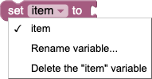
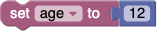
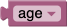
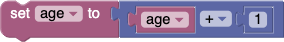
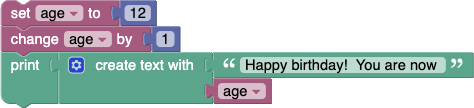

We use the term _variable_ the same as it is used in mathematics and in other programming languages: a named value that can be changed (varies).  Variables can be created in several different ways.
  * Some blocks such as [count with](Loops#count-with) and [for each](Loops#for-each) use a variable and defines its values.  A traditional computer science term for these are [loop variables](https://en.wikipedia.org/wiki/Loop_variable).
  * User-defined functions (also known as "procedures") can define inputs, which creates variables that can be used only within the function.  These are traditionally called "parameters" or "arguments".
  * Users may create variables at any time through the "set" block.  These are traditionally called "[global variables](https://en.wikipedia.org/wiki/Global_variables)".
Blockly does not support [local variables](https://en.wikipedia.org/wiki/Local_variable).

## Dropdown menu

Clicking on a variable's dropdown symbol (triangle) gives the following menu:

The menu provides the following options.
  * the names of all existing variables defined in the program.
  * "Rename variable...", changes the name of this variable wherever it appears in the program.  Selecting this option opens a prompt for the new name.
  * "Delete the variable...", deletes all blocks that reference this variable wherever it appears in the program.

# Blocks

## Set

The **set** block assigns a value to a variable, creating the variable if it doesn't already exist.  For example, this sets the value of the variable named "age" to 12.

## Get

The **get** block provides the value stored in a variable, without changing it.

It is possible, but a bad idea, to write a program in which a **get** appears without a corresponding **set**.

## Change

The **change** block adds a number to a variable.

This is a shortcut for the following construct.

# Example

Consider the following example code:

The first row of blocks creates a variable named "age" and sets its initial value to the number 12.  The second row of blocks gets the value 12, adds 1 to it, and stores the sum (13) into the variable.  The final row displays the message: "Happy birthday!  You are now 13"
