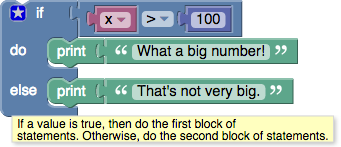

(TODO: Add table of contents.)

# Introduction

[Boolean algebra](https://en.wikipedia.org/wiki/Boolean_algebra) is a mathematical system that has two values:
  * **true**
  * **false**

Boolean values (also called _conditions_) are used in these control block, which contain examples::
  * [conditional blocks](wiki/IfElse)
  * [repeat blocks](wiki/Loops#repeat)

One of the many examples from those pages is:

If the value of the variable **x** is greater than 100, the condition is **true**, and the text "What a big number!" is printed.  If the value of **x** is not greater than 100, the condition is **false**, and "That's not very big." is printed.

Boolean values can also be stored in variables and passed to procedures, the same as number, text, and list values.

# Blocks

If a block expects a Boolean value as an input, it interprets an absent input as **false**.  An example is provided below.  Non-Boolean values cannot be directly plugged in where Boolean values are expected, although it is possible (but inadvisable) to store a non-Boolean value in a variable, then plug that into the input.  Neither of these practices are recommended, and their behavior could change in future versions of Blockly.

## Values

A single block, with a dropdown specifying either **true** or **false**, can be used to get a boolean value:

## not

The **not** block converts its Boolean input into its opposite.  For example, the result of:

is false.

As mentioned above, if no input is provided, a value of **true** is assumed, so the following block produces the value **false**:

Leaving an input empty is not recommended, however.

## comparisons

## logical operations